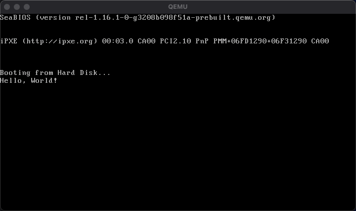

# Real Mode Development

##

BIOS operates in _Real Mode_. Real mode (aka. read address mode) is an operating mode of all x86-compatible CPUs. All code in real mode is required to be 16 bits. Addresses in real mode correspond to real locations in memory. It uses a 20-bit _segmented memory_ address space (= 1MB of addressable memory) and unlimited direct software access to all addressable memory, I/O addresses and peripheral hardware. It does not provide memory protection, multitasking, or code privilege levels. [(wiki)](https://en.wikipedia.org/wiki/Real_mode)

## Printing a string to the screen

1. Edit [`boot.asm`](../boot.asm)

2. Assemble

```
> nasm -f bin ./boot.asm -o ./boot.bin
```

`-f bin` option assembles the file to binary. We don't use object file etc. because there's no concept of executables, file formats, etc. in the BIOS.

Output has no header information. Just raw code output.

```
❯ ll
total 32
-rw-r--r--  1 taiki  staff   501B Jan 29 20:38 boot.asm
-rw-r--r--  1 taiki  staff   512B Jan 29 20:38 boot.bin
```

You can disassemble the bin file to see the contents.

```
> ndisasm ./boot.bin`
00000000  B40E              mov ah,0xe
00000002  B041              mov al,0x41
00000004  CD10              int 0x10
00000006  EBFE              jmp short 0x6
00000008  0000              add [bx+si],al
...
000001FC  0000              add [bx+si],al
000001FE  55                push bp
000001FF  AA                stosb
```

4. Run

```
> qemu-system-x86_64 -hda ./boot.bin
```



## Notes

- `lodsb` is one of x86 memory segmentation instructions. It uses DS (Data Segment) and SI (Source Index) registers. The real memory address is `DS * 16 + SI`.
