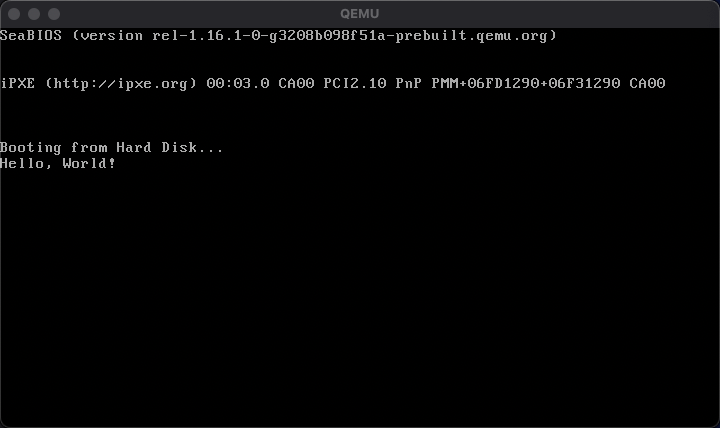
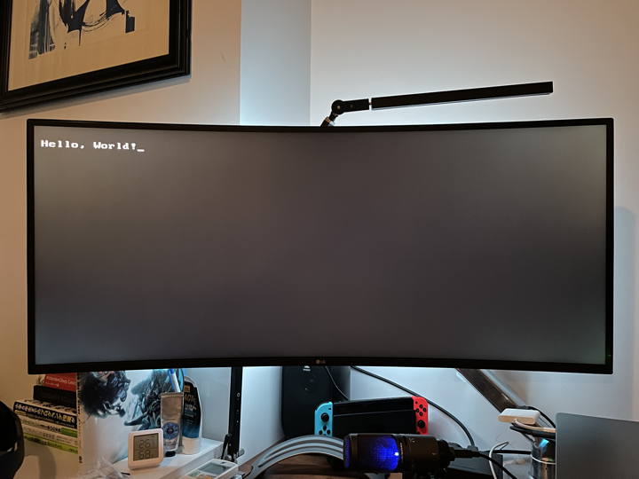

# Real Mode Development

## Writing a bootloader

Bootloader is a set of CPU instructions (usually written in assembly) that is loaded by the BIOS when a PC is booted. Bootloader's code sits at 0x7c00 when loaded into the memory, and must be 1-sector (= 512 bytes) long. The end of the bootloader code is marked by 2-byte signature `0x55AA`.

## Real Mode

BIOS operates in _Real Mode_. Real Mode (aka. read address mode) is an operating mode available to all x86-compatible CPUs. All code in real mode is required to be 16 bits. Addresses in real mode correspond to real locations in memory.

Real Mode uses a 20-bit _segmented memory_ address space (= 1MB of addressable memory) and unlimited direct software access to all addressable memory, I/O addresses and peripheral hardware. It does not provide memory protection, multitasking, or code privilege levels. [(wiki)](https://en.wikipedia.org/wiki/Real_mode)

# Development

## 1. Printing a string to the screen

We write our bootloader in assembly. Aside from the actual bootloader logics, we use _interrupts_ to control the CPU to access its peripherals like I/O devices ([Ralf Brown's Interrupt List](https://www.ctyme.com/rbrown.htm)). Note that these interrupts are **provided by BIOS**.

For this section, we'll print "Hello, World!" on the screen, and for that we'll use [`Int10h`](http://www.ctyme.com/intr/int-10.htm).

---

1. Edit [`boot.asm`](../boot.asm) ([commit](https://github.com/taikiy/kernel/commit/fa5ced2e4e5b3dab0105ed001ef021cc7759e329#diff-ef96aa02ede6928fc12bc906ab8b222af1250dde26bb066466d339e48ab4e658))

2. Assemble

```shell
> nasm -f bin ./boot.asm -o ./boot.bin
```

`-f bin` option assembles the file to binary. We don't use object file etc. because there's no concept of executables, file formats, etc. in the BIOS.

Output has no header information. Just raw code output.

```shell
❯ ll
total 32
-rw-r--r--  1 taiki  staff   501B Jan 29 20:38 boot.asm
-rw-r--r--  1 taiki  staff   512B Jan 29 20:38 boot.bin
```

You can disassemble the bin file to see the contents.

```shell
> ndisasm ./boot.bin`
00000000  B40E              mov ah,0xe
00000002  B041              mov al,0x41
00000004  CD10              int 0x10
00000006  EBFE              jmp short 0x6
00000008  0000              add [bx+si],al
...
000001FC  0000              add [bx+si],al
000001FE  55                push bp
000001FF  AA                stosb
```

4. Run

```shell
> qemu-system-x86_64 -hda ./boot.bin
```



## 2. Set the data segment

In the previous section, `ORG 0x7c00` worked fine. This is because QEMU BIOS starts with DS set to 0. On other BIOS, however, this might not work if it initializes the data segment to, for example, `0x7c0`. In that case, our DS will be `0x7c00 + 0x7c0 * 16` which does not point to `message`.

To prevent this, we set DS ourselves in the assembly. ([commit](https://github.com/taikiy/kernel/commit/6b08bf6ba316d4bcc16c7f214151aca9cfdcfab7#diff-ef96aa02ede6928fc12bc906ab8b222af1250dde26bb066466d339e48ab4e658))

## 3. BIOS Parameter Block (BPB)

Usually, the binary file so far will work fine on real machines, but some BIOS expect what's known as [BPB](https://wiki.osdev.org/FAT#BPB_.28BIOS_Parameter_Block.29). For a maximum compatibility, we should reserve the block if BIOS decides to write some data in this data block. ([commit](https://github.com/taikiy/kernel/commit/ec33f9a20982be55a0caf5eb59890048b4cfd064#diff-ef96aa02ede6928fc12bc906ab8b222af1250dde26bb066466d339e48ab4e658))

## 4. Writing the bootloader to a USB stick

On Mac, just like Linux, you can use `dd` to copy our binary bootloader file to a USB stick. Some commands/options are slightly different.

---

1. Connect a USB stick

2. Check the interface path

```shell
> diskutil list
```

This is equivalent to `fdisk -l` on Linux.

3. Unmount the USB stick

```shell
> diskutil unmountDisk /dev/disk6
```

4. Create the disk image. ❗ _Backup the USB stick before executing this command_ ❗

```shell
> sudo dd if=./boot.bin of=/dev/disk6
```

5. Unplug the stick, plug it into a PC, boot!

---

Don't forget to configure the boot priority :)



## 5. Handling interrupts (exceptions)

In Real Mode, Interrupt Vector Table (IVT) is loaded at 0x00. IVT is a table that specifies the addresses of interrupt _handlers_. Each slot takes 4 bytes - the first 2 bytes is the offset, and the second 2 bytes is the segment.

```
 +-----------+-----------+
 |  Segment  |  Offset   |
 +-----------+-----------+
 4           2           0
```

To define a custom interrupt handler, we first define a routine with a label, and then write the segment/offset of the routine to IVT. ([commit](https://github.com/taikiy/kernel/commit/8a5fb00bc8bdaf47af6cb9de8ac107e8a6655db6#diff-ef96aa02ede6928fc12bc906ab8b222af1250dde26bb066466d339e48ab4e658))

## 6. Reading from the disk

We add [`message.txt`](../message.txt) file and append the content to `boot.bin` using `dd` command (see [`Makefile`](../Makefile)). When we start up a QEMU with `boot.bin`, it treats it as a hard disk.

Whenever CPU reads data from a hard disk, it must be one full sector (512 bytes). We need to make sure that our message (starting from the second sector 0x200 because we use the first sector for our bootloader code), is padded with zeros until the end of the sector

Disk access is done via [`Int13h/AH=02h`](http://www.ctyme.com/intr/rb-0607.htm).

Note how we created an empty label called `buffer` at the very end of the bootloader code. Because the bootloader code is 512 bytes, this label is not loaded into the memory. That doesn't mean we cannot use the memory pointed by this label. Since the label is at the end, it points to 0x7e00 = 0x7c00 (start of the bootloader) + 0x200 (512 bytes).

## Notes

- `lodsb` is one of x86 memory segmentation instructions. It uses DS (Data Segment) and SI (Source Index) registers. The real memory address is `DS * 16 + SI`.

---

[next](./protected_mode_development_1.md)
